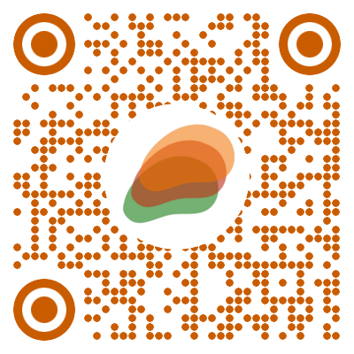

# Slice (EATSeg)
Slice is a tool designed to help clinicians and researchers quickly and efficiently carry out epicardia adipose tissue (EAT) related researches.

## Download

Visit the [release page](https://github.com/MountainAndMorning/EATSeg/releases) to download an appropriate version. Both [MacOS](https://github.com/MountainAndMorning/EATSeg/releases/download/v2.0/Slice-2.0.0.dmg.zip) and [Windows 10](https://github.com/MountainAndMorning/EATSeg/releases/download/v2.0/Slice.Setup.2.0.0.exe) are supported.

## Useage

For more help, you can connect the developer by the e-mail (18207481578@163.com) or scan the QR code in WeChat.

## Citation

Please cite the software by this paper:

Li, Xiaogang, et al. "Automatic quantification of epicardial adipose tissue volume." Medical Physics 48.8 (2021): 4279-4290.

# v2.0
## Improved
- Rewrite the whole software by javascript
- The speed and stability are both highly improved
- The name is changed to Slice.

# v0.3
## Improved
- Retrain pericardium segmentation deep learning model on  a larger dataset.
- Reduce the memory consumption when segmenting the pericardium.
- Change the database location to the app data folder. For Windows this folder is `~/AppData/Local/EATSeg`. For MacOS this folder is `~/Library/Application Support/EATSeg`.

## Fixed
- The export function can not work normally. Fixed.

